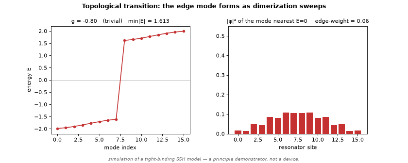
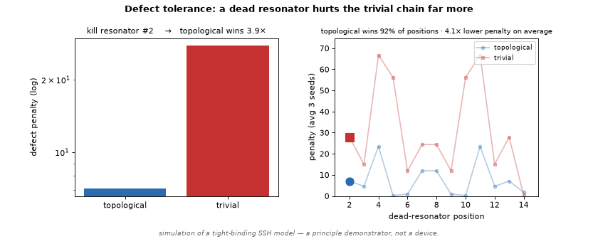
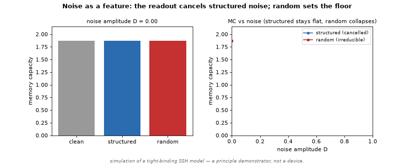

# Topological phononic reservoir

**When does topological structure make an analog reservoir tolerate a dead element — and when doesn't it?**

A pre-registered simulation study of the SSH resonator chain used as a physical reservoir, taken down the full scoping ladder until the claim stopped giving. Conducted under the [gbranaa4-hue method](gbranaa4-hue-method.pdf): pre-register the test, validate the instrument, split the average, find the boundary, and write the "no" as carefully as the "yes."

## The result, in one sentence

Topological structure protects a reservoir's computation against a dead element **exactly when chiral symmetry holds** — several-fold in the idealized model, weaker under nonlinearity and noise, beaten by generic redundancy, and only marginally (statistically inconclusive) in a realistic damped/nonlinear device. **The idealized magnitude does not transfer to hardware; the chiral boundary condition does.**

**Preprint:** [preprint.pdf](preprint.pdf) (source: [PREPRINT.md](PREPRINT.md)) — the formal write-up, ready for Zenodo. Extended lab report with every number and the honest ledger of what did *not* hold: **[LAB_REPORT.md](LAB_REPORT.md)**.

## Demos — every frame computed live from the real method

**The topological edge mode forming as the dimerization sweeps trivial → topological:**



**A dead resonator swept along the chain — topological degrades more gracefully (linear task, idealized model):**



**Noise as a feature — the trained readout cancels structured noise; only the full-rank thermal floor survives:**



## Run it

No dependencies beyond `numpy` + `matplotlib`.

```bash
python phononic_methods.py   # self-test: reproduces the reported numbers (the fidelity check)
python dashboard.py          # interactive: sliders over edge mode / defect / noise, live
python animate.py            # regenerate the three GIFs above
```

## What's here

- **[LAB_REPORT.md](LAB_REPORT.md)** — the honest, fully-scoped write-up + ledger.
- `phononic_methods.py` — the core methods, verbatim, with a self-test that reproduces the paper numbers.
- `dashboard.py`, `animate.py` — interactive + shareable demos on top of the verified methods.
- ~20 pre-registered experiment scripts — edge mode & chiral-conditional protection, defect-tolerance & bulk scaling (8→64 nodes), high-Q noise crossover, noise-as-a-feature (readout subspace cancellation), nonlinear NARMA10, architecture control (redundancy), the physically-faithful damped/Duffing device model, and the pre-registered chiral firm-up. See the reproducibility list in the report.

## Scope (read before citing)

Simulation only (tight-binding + a damped/driven Duffing ODE model); linear-memory and NARMA10 reservoir tasks. This is a **candidate primitive characterized honestly**, not a fabricated device — and **not** a quantum computer. A hardware build would need deliberate chiral-symmetry engineering merely to avoid a *reversal* of the effect, and should expect a modest advantage, not the idealized ~5×.

## Related

- [methodlm](https://github.com/gbranaa4-hue/methodlm) — the honest-measurement / causal-reasoning harness.
- The operating discipline this study followed: [gbranaa4-hue-method.pdf](gbranaa4-hue-method.pdf).
